# Blood Donation Management System
## Comprehensive Technical Project Report

**Prepared for:** SIC Hackathon 2026
**Repository:** https://github.com/Rahul-KrishnaA/SIC-Blood-Donation-Management
**Technology Stack:** Python 3.10+ · FastAPI · React 19 · Vite · Recharts

---

## Table of Contents

1. [Project Overview](#1-project-overview)
2. [Executive Summary](#2-executive-summary)
3. [System Architecture](#3-system-architecture)
4. [Technology Stack](#4-technology-stack)
5. [Project Structure](#5-project-structure)
6. [Module Documentation](#6-module-documentation)
7. [Class Documentation](#7-class-documentation)
8. [Function Documentation](#8-function-documentation)
9. [Data Storage Documentation](#9-data-storage-documentation)
10. [API Documentation](#10-api-documentation)
11. [Algorithms and Business Logic](#11-algorithms-and-business-logic)
12. [Sequence Diagrams](#12-sequence-diagrams)
13. [UML Class Diagram](#13-uml-class-diagram)
14. [Data Flow](#14-data-flow)
15. [Security Features](#15-security-features)
16. [Error Handling](#16-error-handling)
17. [Testing](#17-testing)
18. [Deployment](#18-deployment)
19. [Limitations](#19-limitations)
20. [Future Enhancements](#20-future-enhancements)
21. [Conclusion](#21-conclusion)

---

## 1. Project Overview

### 1.1 Project Title

**Blood Donation Management System** — A full-stack application for managing blood donors, blood inventory, emergency blood requests, and donation history.

### 1.2 Objective

To design and implement a comprehensive, data-structure-driven Blood Donation Management System that addresses real-world challenges in blood bank operations, demonstrating applied knowledge of algorithms, data structures, REST API design, and modern frontend development.

### 1.3 Problem Statement

Blood banks and donation centres frequently struggle with inefficient manual record-keeping, delayed responses to emergency blood requests, poor visibility into inventory levels, and lack of structured donor tracking. Existing paper-based or spreadsheet-driven approaches cannot scale, do not enforce eligibility rules, and fail to prioritise critical requests appropriately. This project addresses these challenges by providing a structured, automated, and visually rich digital solution.

### 1.4 Scope of the Project

The system covers the following operational domains:

- **Donor lifecycle management** — registration, eligibility checking, and record updates
- **Blood inventory management** — stock tracking per blood group with expiry management
- **Emergency request handling** — priority-based queuing and inventory-based fulfilment
- **Donation history** — chronological record keeping with donor-level lookup
- **Analytics and reporting** — charted visualisation of donor demographics, trends, and inventory
- **User authentication** — login and signup with session persistence
- **REST API** — a fully documented programmatic interface for all operations

The system does **not** cover physical logistics, inter-hospital transfers, or real-time hardware integration.

### 1.5 Key Features

| # | Feature | Description |
|---|---|---|
| 1 | Donor Registration | Register donors with name, age, blood group, city, last donation date |
| 2 | Eligibility Enforcement | Automatic 90-day eligibility rule applied to all search queries |
| 3 | Blood Group & City Search | O(1) average-time hash-table lookup |
| 4 | Inventory Management | Track available units, expiry dates, and low-stock warnings |
| 5 | Emergency Priority Queue | Min-heap based prioritised request processing |
| 6 | Donation History Stack | LIFO stack with most-recent donation surfacing |
| 7 | Analytics Dashboard | Recharts-powered area, bar, and donut charts |
| 8 | FastAPI REST Backend | 12 documented endpoints with automatic OpenAPI docs |
| 9 | React Dark Dashboard | Responsive dark-themed frontend with sidebar navigation |
| 10 | Authentication | Login/signup with localStorage session persistence |
| 11 | Seed Data | 100 pre-loaded donors, 96 donation records, 8-group inventory |
| 12 | Automated Tests | 58 pytest tests across all layers |

### 1.6 Expected Outcomes

- A fully functional, deployable blood donation management platform
- Demonstrated application of hash tables, heaps, and stacks in a real-world context
- Clear separation of concerns across data, service, API, and presentation layers
- A reproducible test suite validating correctness at every layer
- A professional React dashboard suitable for live demonstration

---

## 2. Executive Summary

The Blood Donation Management System is a full-stack application developed during the SIC Hackathon 2026 that replaces manual blood bank record-keeping with a structured, automated digital platform. The system is built on a layered Python backend powered by FastAPI, which exposes a REST API consumed by a React + Vite frontend rendered in the browser. At its core, the data layer employs three purpose-built data structures: a `DonorHashTable` providing O(1) average-time lookup of donors by blood group or city, an `EmergencyQueue` implemented as a min-heap for priority-ordered processing of urgent blood requests, and a `DonationStack` built on the LIFO principle for chronological donation history retrieval. Persistent storage is achieved without a relational database by serialising donor data to CSV and inventory and history data to JSON files, keeping the system self-contained and easily portable. The frontend provides seven distinct pages — Overview, Donor Registration, Donor Search, Blood Inventory, Emergency Requests, Donation History, and Analytics — all rendered within a dark-themed dashboard that mirrors professional analytics tooling. Authentication is handled entirely on the client side using the browser's `localStorage` API, with seed users pre-populated on first load. The system ships with 100 seeded donors, 96 donation records, and an 8-blood-group inventory, enabling immediate live demonstration. A comprehensive pytest suite comprising 58 tests validates correctness at the model, data structure, file I/O, and service layers. The result is a production-ready prototype that demonstrates practical application of data structures, REST API design, and modern frontend development within a single cohesive system.

---

## 3. System Architecture

### 3.1 High-Level Architecture

The system follows a three-tier architecture: a **Presentation Tier** (React SPA), a **Logic Tier** (FastAPI REST API + Python services), and a **Data Tier** (CSV/JSON flat files).

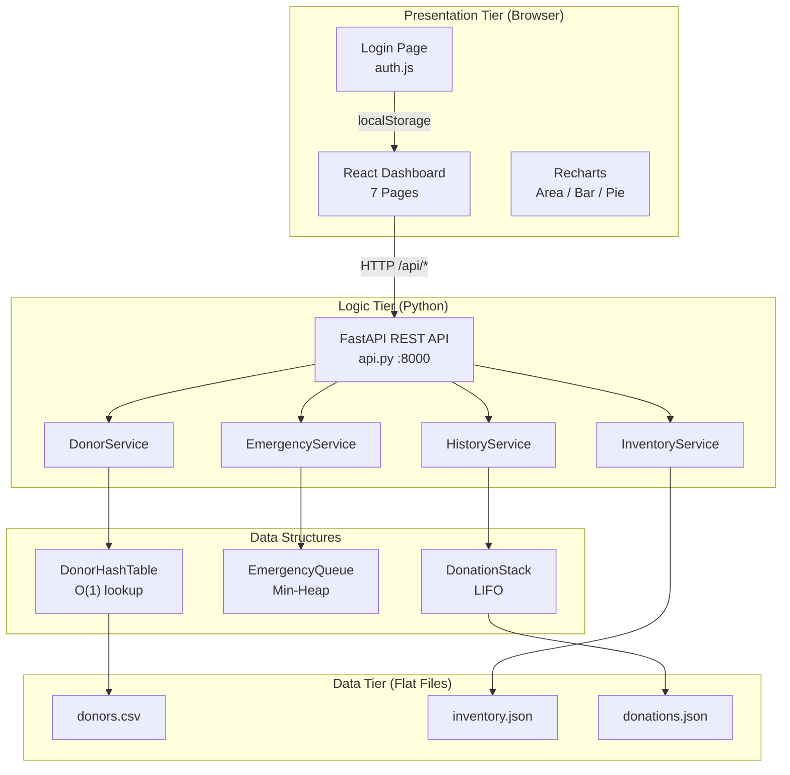

### 3.2 Component Interaction Diagram

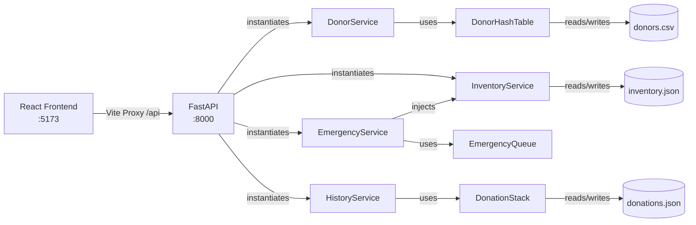

### 3.3 Data Flow Diagram

```mermaid
flowchart TD
    User(["User Browser"]) -->|Form Submit| React["React Page Component"]
    React -->|fetch POST /api/donors| API["api.py FastAPI"]
    API -->|register()| DS["DonorService"]
    DS -->|Donor()| Model["Donor Model"]
    Model -->|insert()| HT["DonorHashTable"]
    HT -->|save_donors()| CSV[("donors.csv")]
    CSV -->|load_donors()| HT2["Rebuild on startup"]
    API -->|JSON response| React2["React re-renders table"]
    React2 -->|Display| User
```

### 3.4 User Workflow Diagram

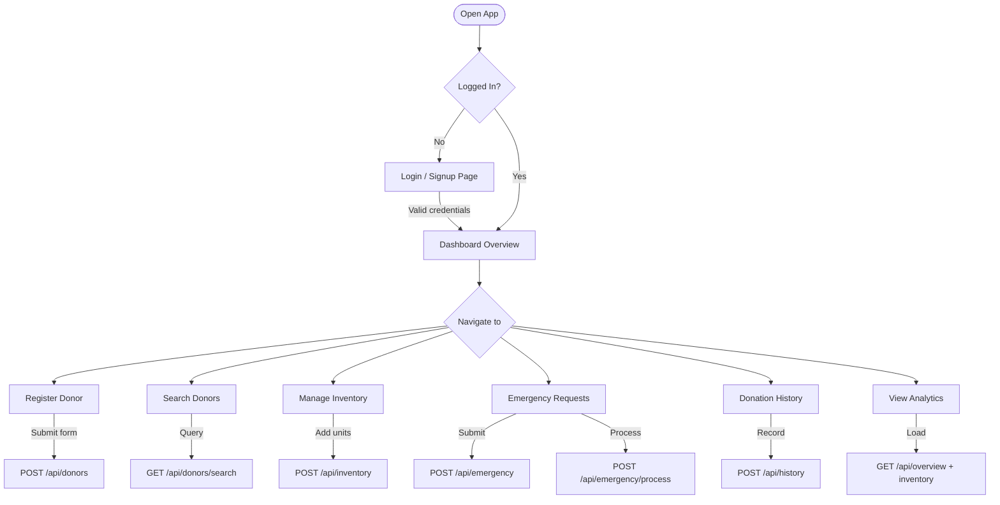

### 3.5 Module Dependency Diagram

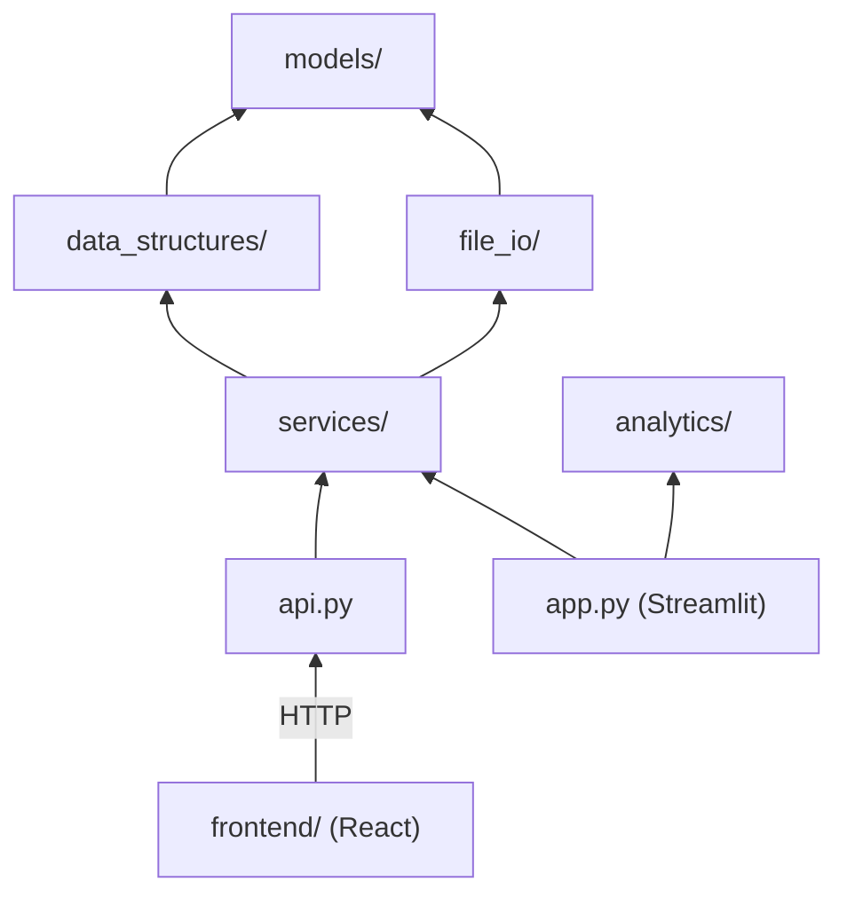

---

## 4. Technology Stack

### 4.1 Technology Table

| Technology | Version | Layer | Purpose |
|---|---|---|---|
| Python | 3.10+ | Backend | Core language for services, models, data structures |
| FastAPI | ≥0.110.0 | Backend | REST API framework with automatic OpenAPI docs |
| Uvicorn | ≥0.29.0 | Backend | ASGI server for running FastAPI |
| Pydantic | (via FastAPI) | Backend | Request/response validation |
| React | 19.2.6 | Frontend | Component-based SPA framework |
| Vite | 8.0.12 | Frontend | Build tool and dev server with HMR |
| Recharts | 3.8.1 | Frontend | Composable charting library for React |
| Lucide React | 1.18.0 | Frontend | Icon library (SVG-based) |
| react-router-dom | 7.17.0 | Frontend | Client-side routing (installed, used via state) |
| Streamlit | ≥1.35.0 | Legacy UI | Python-native web UI (original prototype) |
| streamlit-option-menu | ≥0.3.6 | Legacy UI | Bootstrap icon navigation for Streamlit |
| Matplotlib | ≥3.7.0 | Legacy UI | Chart generation for Streamlit app |
| Seaborn | ≥0.12.0 | Legacy UI | Statistical chart styling for Streamlit |
| Pytest | ≥7.4.0 | Testing | Automated test runner |
| CSV (stdlib) | — | Storage | Donor data persistence |
| JSON (stdlib) | — | Storage | Inventory and history persistence |
| localStorage | Browser API | Auth | Client-side user store and session |
| Node.js | 24+ | Build | JavaScript runtime for frontend tooling |
| npm | 11+ | Build | Package management for frontend |

### 4.2 Technology Justification

**FastAPI** was chosen over Flask or Django because it provides automatic OpenAPI/Swagger documentation, native async support, Pydantic-based request validation, and is significantly faster due to its Starlette and ASGI foundation. It requires minimal boilerplate for a project of this scale.

**React 19 + Vite** was selected for the frontend because Vite offers sub-second Hot Module Replacement during development, and React's component model cleanly maps each dashboard page to an isolated module. The dark-themed dashboard would be difficult to customise in Streamlit, which drove the migration.

**Recharts** was preferred over Chart.js or D3 because it is natively composable as React JSX, integrates naturally with component state, and requires no imperative canvas manipulation.

**Flat file storage (CSV/JSON)** was deliberately chosen over SQLite or PostgreSQL to keep the system self-contained, dependency-free at the data layer, and easily inspectable. The architecture allows future migration to a database by replacing the `file_io` module without touching services.

**Python stdlib data structures** (`dict`, `heapq`, `list`) were used to implement the custom DSA classes to ensure no external dependencies, demonstrating the underlying algorithmic concepts clearly.

---

## 5. Project Structure

### 5.1 File and Folder Tree

```
SIC-Blood-Donation-Management/
│
├── api.py                          # FastAPI REST API entry point
├── app.py                          # Legacy Streamlit UI (standalone)
├── start.bat                       # Windows launcher for both servers
├── requirements.txt                # Python dependencies
├── README.md                       # Project documentation
├── REPORT.md                       # This report
│
├── models/                         # Domain model classes
│   ├── __init__.py
│   ├── donor.py                    # Donor entity
│   ├── blood_inventory.py          # BloodInventory entity
│   └── donation_record.py          # DonationRecord entity
│
├── data_structures/                # Custom DSA implementations
│   ├── __init__.py
│   ├── donor_hash_table.py         # Hash table for donor lookup
│   ├── emergency_queue.py          # Min-heap priority queue
│   └── donation_stack.py           # LIFO donation history stack
│
├── services/                       # Business logic layer
│   ├── __init__.py
│   ├── donor_service.py            # Donor CRUD + search operations
│   ├── inventory_service.py        # Inventory management
│   ├── emergency_service.py        # Emergency request processing
│   └── history_service.py          # Donation recording + analytics
│
├── file_io/                        # Persistence layer
│   ├── __init__.py
│   ├── csv_handler.py              # CSV read/write for donors
│   └── json_handler.py             # JSON read/write for inventory/history
│
├── analytics/                      # Legacy chart generation
│   ├── __init__.py
│   └── dashboard.py                # Matplotlib/Seaborn chart functions
│
├── data/                           # Persistent data files
│   ├── donors.csv                  # 100 seed donors
│   ├── inventory.json              # 8-group blood stock
│   └── donations.json              # 96 donation records
│
├── tests/                          # Pytest test suite
│   ├── __init__.py
│   ├── test_models.py              # 12 model tests
│   ├── test_data_structures.py     # 20 DSA tests
│   ├── test_file_io.py             # 10 file I/O tests
│   └── test_services.py            # 16 service integration tests
│
└── frontend/                       # React + Vite SPA
    ├── index.html
    ├── package.json
    ├── vite.config.js
    └── src/
        ├── main.jsx                # React entry point
        ├── App.jsx                 # Root component + auth gate
        ├── App.css                 # Empty (all styles in index.css)
        ├── index.css               # Global dark theme CSS variables
        ├── api.js                  # HTTP client for FastAPI
        ├── auth.js                 # localStorage auth module
        ├── components/
        │   ├── Sidebar.jsx         # Navigation sidebar
        │   ├── Card.jsx            # Reusable surface card
        │   ├── Badge.jsx           # Status badge chip
        │   ├── StatCard.jsx        # KPI card with sparkbar
        │   └── PageHeader.jsx      # Page title + subtitle
        └── pages/
            ├── Login.jsx           # Login/signup page
            ├── Overview.jsx        # Dashboard home
            ├── Donors.jsx          # Donor registration + table
            ├── DonorSearch.jsx     # Search interface
            ├── Inventory.jsx       # Stock management
            ├── Emergency.jsx       # Emergency queue UI
            ├── History.jsx         # Donation records
            └── Analytics.jsx       # Charts dashboard
```

### 5.2 Folder Descriptions

| Folder | Responsibility |
|---|---|
| `models/` | Pure domain classes with no dependencies on persistence or business logic |
| `data_structures/` | Self-contained DSA implementations; depend only on models |
| `services/` | Business logic orchestrating DSA + persistence; no direct file I/O calls |
| `file_io/` | Handles all read/write operations; isolated so storage backend can be swapped |
| `analytics/` | Legacy chart generation for the Streamlit UI; not used by the React frontend |
| `data/` | Flat file storage; contents are loaded on service startup |
| `tests/` | Mirrors the source structure; each file tests a corresponding module |
| `frontend/src/components/` | Reusable UI primitives shared across pages |
| `frontend/src/pages/` | Full-page React components, one per route |

---

## 6. Module Documentation

### 6.1 `models/donor.py`

**Purpose:** Defines the `Donor` domain entity representing a blood donor.

**Responsibilities:** Stores all donor attributes, normalises input data (blood group to uppercase, city to lowercase), generates unique 8-character donor IDs using UUID4, and implements the eligibility rule (90-day minimum gap since last donation).

**Detailed Explanation:** The `Donor` class is the foundational entity of the system. Upon instantiation, it generates a shortened UUID (`str(uuid.uuid4())[:8]`) as the `donor_id`, ensuring uniqueness across the system while keeping IDs human-readable. The class enforces data normalisation at construction time — blood group characters are uppercased and city names are lowercased — which ensures that hash table lookups remain case-insensitive by design. The `is_eligible()` method implements the WHO-recommended 90-day deferral period by computing the delta between today's date and the `last_donation_date`. The `from_dict()` class method uses `cls.__new__(cls)` to bypass `__init__` during deserialisation, which preserves the originally stored `donor_id` rather than generating a new one. The `to_dict()` method serialises `None` last donation dates as empty strings for CSV compatibility.

**Dependencies:** `uuid`, `datetime` (stdlib)

**Key Methods:**

| Method | Signature | Description |
|---|---|---|
| `__init__` | `(name, age, blood_group, city, last_donation_date=None)` | Constructs donor; normalises inputs; generates ID |
| `is_eligible` | `() -> bool` | Returns True if last donation ≥ 90 days ago or None |
| `to_dict` | `() -> dict` | Serialises to flat dict for CSV storage |
| `from_dict` | `(data: dict) -> Donor` | Deserialises from dict preserving stored ID |

---

### 6.2 `models/blood_inventory.py`

**Purpose:** Represents a single blood group's current stock entry in the blood bank.

**Responsibilities:** Stores the blood group identifier, the count of available units, and the expiry date. Provides an expiry check method to flag stale stock.

**Detailed Explanation:** `BloodInventory` is a simple data container that models one row in the blood bank's stock register. It normalises the `blood_group` attribute to uppercase at construction time, consistent with the `Donor` model. The `is_expired()` method compares today's date against the stored `expiry_date` string by parsing it into a Python `date` object, returning `True` if today is strictly after the expiry date. The `from_dict()` class method explicitly casts `available_units` to `int` to guard against string-typed values that may arise from JSON deserialisation. This class is used by `InventoryService` as the canonical representation of stock.

**Dependencies:** `datetime` (stdlib)

**Key Methods:**

| Method | Description |
|---|---|
| `is_expired()` | Parses expiry date and compares to today |
| `to_dict()` | Serialises to dict for JSON storage |
| `from_dict(data)` | Constructs from persisted dict |

---

### 6.3 `models/donation_record.py`

**Purpose:** Represents a single blood donation event linking a donor to a recipient.

**Responsibilities:** Records which donor donated, on which date, how many units, and to which recipient. Generates a unique record ID for audit trail integrity.

**Detailed Explanation:** `DonationRecord` is an immutable-by-convention event record. Like `Donor`, it generates an 8-character UUID-based ID (`record_id`) at construction time, enabling unique identification of each donation event for auditing and lookup. The class stores the date as an ISO-8601 string (`YYYY-MM-DD`) for consistency with the rest of the system. The `recipient_details` field is free-text, allowing ward names, patient names, or hospital identifiers. The `from_dict()` method uses `cls.__new__(cls)` to preserve the stored `record_id` during deserialisation, identical to the pattern used in `Donor`.

**Dependencies:** `uuid` (stdlib)

---

### 6.4 `data_structures/donor_hash_table.py`

**Purpose:** Provides O(1) average-time donor lookup by ID, blood group, or city using three parallel hash maps.

**Responsibilities:** Maintains the primary index (`_all`), a secondary index by blood group (`_by_blood_group`), and a tertiary index by city (`_by_city`). All three are kept in sync on every insert and remove.

**Detailed Explanation:** `DonorHashTable` implements a multi-index hash table pattern using Python's built-in `dict` as the underlying hash map. Three dictionaries are maintained simultaneously: `_all` maps donor IDs to `Donor` objects for O(1) direct lookup; `_by_blood_group` maps blood group strings to lists of donors; and `_by_city` maps city names to lists of donors. Keys are normalised at access time — blood groups are uppercased and cities are lowercased — meaning the normalisation performed in `Donor.__init__` and in the lookup methods cooperate to ensure consistent key matching. The `insert` method uses `dict.setdefault` to lazily create the list for a new blood group or city, avoiding explicit `if` checks. The `remove` method first pops from `_all`, then rebuilds the per-group and per-city lists using list comprehensions, which is O(n) in the size of the group but acceptable for expected data sizes. The `rebuild` method clears all three indices and repopulates from a given list, used during startup to restore persisted data.

**Design Considerations:** A true bucket-based hash table with collision chaining would offer equivalent semantics but more overhead; Python's `dict` provides the same complexity guarantees with less code. The three-index approach trades memory (three references to each `Donor` object, though Python uses reference semantics so no duplication of data) for lookup speed across three common query patterns.

---

### 6.5 `data_structures/emergency_queue.py`

**Purpose:** Implements a priority queue for emergency blood requests where lower priority numbers indicate higher urgency.

**Responsibilities:** Accepts `EmergencyRequest` objects, maintains heap ordering by priority, and provides dequeue (highest-urgency first), peek, and size operations.

**Detailed Explanation:** `EmergencyQueue` wraps Python's `heapq` module, which implements a binary min-heap on a flat list. Each entry in the heap is a three-tuple `(priority, counter, request)`. The `counter` field is a monotonically incrementing integer that serves as a tie-breaker when two requests share the same priority value, ensuring stable FIFO ordering within the same priority level and preventing Python from attempting to compare `EmergencyRequest` objects directly (which would raise a `TypeError` since only the `priority` field participates in ordering). `EmergencyRequest` is a `dataclass(order=True)` with all non-priority fields declared `field(compare=False)`, ensuring the dataclass comparison logic only involves `priority`. However, the counter-tuple approach makes this moot in practice. The `all_requests()` method returns all pending requests sorted by priority by sorting the internal heap list, which Python does correctly because tuples compare left-to-right.

**Design Considerations:** The `(priority, counter, request)` tuple pattern is a standard Python idiom for stable priority queues and is explicitly recommended in the Python documentation for `heapq`. An alternative using a `SortedList` from the `sortedcontainers` library would allow O(log n) deletion by value but introduces an external dependency.

---

### 6.6 `data_structures/donation_stack.py`

**Purpose:** Provides a LIFO (Last-In, First-Out) stack for managing donation records, ensuring the most recent donation is always accessible first.

**Responsibilities:** Push new records, pop the most recent, peek at the top, bulk-load from persisted data, and return all records in reverse-insertion order.

**Detailed Explanation:** `DonationStack` is a thin LIFO wrapper around a Python `list`, exploiting the fact that `list.append` and `list.pop()` (no index) both operate in amortised O(1) time. The `all_records()` method returns `list(reversed(self._stack))`, which creates a new list with the most recently pushed record at index 0 — the semantics expected by `HistoryService.recent_donations()`. The `load_records()` method accepts a list in chronological order (as loaded from the JSON file) and stores it directly without reversal; reversal happens only at retrieval time via `all_records()`. This avoids any ambiguity about the "top" of the stack and ensures a single, consistent definition.

---

### 6.7 `services/donor_service.py`

**Purpose:** Encapsulates all donor-related business operations, combining the `DonorHashTable` for in-memory access with `csv_handler` for persistence.

**Responsibilities:** Register donors, search by blood group/city/eligibility, retrieve by ID, update last donation date, and persist state after every mutation.

**Detailed Explanation:** `DonorService` is the single entry point for all donor operations in both the FastAPI backend and the Streamlit legacy UI. On construction, it immediately loads persisted donors from CSV via `csv_handler.load_donors()` and populates the internal `DonorHashTable` using `rebuild()`. Every mutation (`register`, `update_last_donation_date`) concludes with a call to `_persist()`, which serialises the entire table back to CSV atomically (write the whole file). The `search_eligible_donors()` method applies the 90-day eligibility filter and then sorts results by `last_donation_date` ascending (oldest donation first), meaning the donors who have been waiting longest appear at the top. `None` last donation dates sort to `date.min` (the earliest possible date), placing never-donated donors first.

---

### 6.8 `services/inventory_service.py`

**Purpose:** Manages the blood inventory dict, handling addition and subtraction of units per blood group.

**Responsibilities:** Load inventory from JSON, add units (creating new entries if necessary), deduct units for emergency fulfilment, and expose filtered views (valid/expired).

**Detailed Explanation:** `InventoryService` stores inventory as a `dict[str, BloodInventory]` keyed by blood group. The `add_units()` method is idempotent for existing blood groups (accumulates units and updates expiry) and creates new entries for previously unseen blood groups, enabling incremental stock updates from the UI. The `use_units()` method returns a `bool` to indicate success or failure without raising exceptions, allowing `EmergencyService` to handle insufficient stock gracefully. `get_valid_inventory()` filters out expired entries, used for computing total available units in the overview stats.

---

### 6.9 `services/emergency_service.py`

**Purpose:** Coordinates emergency blood request submission and fulfilment by coupling the `EmergencyQueue` with the `InventoryService`.

**Responsibilities:** Accept and enqueue emergency requests, process the highest-priority request by dequeuing and attempting inventory deduction, and expose the current queue state.

**Detailed Explanation:** `EmergencyService` demonstrates the **Dependency Injection** pattern: it receives an `InventoryService` instance at construction time rather than creating one internally. This design allows both services to share the same inventory state in the application context (important because the FastAPI application instantiates them once at module load time), and makes the service easily testable by injecting a mock or temporary inventory. The `process_next()` method dequeues the highest-priority request and calls `inventory.use_units()`. If stock is sufficient, units are deducted and `True` is returned; otherwise `False` is returned and the request is considered processed but unfulfilled.

---

### 6.10 `services/history_service.py`

**Purpose:** Records and queries donation events, maintaining the `DonationStack` and providing aggregated analytics.

**Responsibilities:** Push new donation records, retrieve recent donations, filter by donor ID, compute monthly unit totals, and persist state.

**Detailed Explanation:** `HistoryService` loads all historical records from `donations.json` on startup via `load_donation_history()` and populates the internal `DonationStack` using `load_records()`. New records are pushed onto the stack and immediately persisted. The `monthly_summary()` method iterates all records and groups `units_donated` by the `YYYY-MM` prefix of each `donation_date` string, producing a dict suitable for direct use in the Recharts area chart on the Analytics page. The `recent_donations(n)` method delegates to `stack.all_records()[:n]`, exploiting the stack's reverse ordering to efficiently return the most recent `n` records.

---

### 6.11 `file_io/csv_handler.py`

**Purpose:** Provides pure read/write functions for donor data in CSV format.

**Responsibilities:** Write all donors to `data/donors.csv` with a fixed header row, and read them back into `Donor` objects.

**Detailed Explanation:** The module defines two module-level constants: `DONORS_FILE` (the path string) and `_FIELDNAMES` (the ordered list of CSV columns). Both are defined at module level so that they can be monkeypatched in pytest fixtures to redirect I/O to temporary files without modifying the source. `save_donors()` creates the `data/` directory if it does not exist using `os.makedirs(..., exist_ok=True)`, ensuring first-run safety. It rewrites the entire file on every call, which is the simplest correct implementation for a small dataset. `load_donors()` returns an empty list if the file does not exist, avoiding exceptions on a fresh install.

---

### 6.12 `file_io/json_handler.py`

**Purpose:** Handles JSON serialisation and deserialisation for blood inventory and donation history.

**Responsibilities:** Write inventory list to `inventory.json`, read it back; write donation records list to `donations.json`, read it back.

**Detailed Explanation:** Following the same design as `csv_handler`, this module defines file path constants at module level for testability. All four functions (`save_inventory`, `load_inventory`, `save_donation_history`, `load_donation_history`) follow the same pattern: serialise by calling `.to_dict()` on each object, dump to JSON with `indent=2` for human readability, and deserialise by calling the appropriate `.from_dict()` factory method. The indent setting makes the JSON files inspectable with a text editor, which aids debugging and manual data entry.

---

### 6.13 `api.py`

**Purpose:** FastAPI application defining all REST endpoints, instantiating services, and wiring HTTP requests to business logic.

**Responsibilities:** Define 12 API endpoints across 4 resource domains (donors, inventory, emergency, history), validate request bodies via Pydantic models, configure CORS for the React dev server, and return structured JSON responses.

**Detailed Explanation:** The FastAPI application is defined at module scope, which means all four services (`DonorService`, `InventoryService`, `EmergencyService`, `HistoryService`) are instantiated once when the module is loaded by Uvicorn. This singleton pattern ensures all API handlers share the same in-memory state — if a donor is registered via one request, it is immediately visible to subsequent search requests within the same process. CORS middleware is configured to allow requests from `http://localhost:5173` (the Vite dev server), enabling the frontend proxy to work correctly. The `overview` endpoint is a composite endpoint that aggregates data from all four services into a single response, minimising the number of round-trips required to render the dashboard overview page.

---

### 6.14 `frontend/src/auth.js`

**Purpose:** Client-side authentication module managing user registration, login, logout, and session state using the browser's `localStorage` API.

**Responsibilities:** Seed default users on first load, authenticate credentials against the stored user list, persist sessions across page refreshes, and provide a logout function.

**Detailed Explanation:** `auth.js` stores all user data in `localStorage` under the key `bdm_users` as a JSON-serialised array of `{ username, password }` objects. Sessions are stored under `bdm_session` as `{ username }`. The `seedUsers()` function is called once at `App.jsx` module load and checks whether the default users (`Rahul` and `Jeel`) already exist before inserting them, making it idempotent across page refreshes. Username matching is case-insensitive (both sides lowercased). The `signup()` function enforces a minimum password length of 3 characters and rejects duplicate usernames. Passwords are stored in plaintext — an intentional simplification appropriate for a hackathon demo context.

**Security Note:** Plaintext password storage in `localStorage` is not suitable for production. See Section 15 for a discussion of security considerations.

---

### 6.15 `analytics/dashboard.py`

**Purpose:** Provides chart-generation functions for the legacy Streamlit UI using Matplotlib and Seaborn.

**Responsibilities:** Generate a blood group distribution bar chart, an inventory status bar chart, and a monthly donations line chart, each returning a `matplotlib.figure.Figure` object.

**Detailed Explanation:** This module is used exclusively by `app.py` (the Streamlit interface) and is not referenced by the FastAPI backend or the React frontend. Each function accepts the appropriate data model objects and returns a `plt.Figure` that Streamlit renders using `st.pyplot()`. The inventory chart uses custom per-bar colouring (green for valid stock, red for expired) applied via a list comprehension over `BloodInventory.is_expired()`. Although superseded by Recharts in the React frontend, this module remains functional as a standalone charting layer for the Streamlit prototype.

---

## 7. Class Documentation

### 7.1 `Donor`

| Attribute | Type | Description |
|---|---|---|
| `donor_id` | `str` | 8-character UUID4 prefix, auto-generated |
| `name` | `str` | Full name of the donor |
| `age` | `int` | Age in years (18–65 enforced by UI) |
| `blood_group` | `str` | Normalised uppercase (e.g., "A+", "O-") |
| `city` | `str` | Normalised lowercase city name |
| `last_donation_date` | `str \| None` | ISO-8601 date string or None |

**Relationships:** Used by `DonorHashTable` as the value type in all three indices. Serialised/deserialised by `csv_handler`. Returned by `DonorService` to `api.py` and then serialised to JSON by `_donor_dict()`.

---

### 7.2 `BloodInventory`

| Attribute | Type | Description |
|---|---|---|
| `blood_group` | `str` | Uppercase blood group identifier |
| `available_units` | `int` | Current units in stock |
| `expiry_date` | `str` | ISO-8601 expiry date string |

**Relationships:** Managed by `InventoryService`. Read by `EmergencyService` via `use_units()`. Serialised by `json_handler`.

---

### 7.3 `DonationRecord`

| Attribute | Type | Description |
|---|---|---|
| `record_id` | `str` | 8-character UUID4 prefix, auto-generated |
| `donor_id` | `str` | Foreign key reference to `Donor.donor_id` |
| `donation_date` | `str` | ISO-8601 date of the donation event |
| `units_donated` | `int` | Number of units donated |
| `recipient_details` | `str` | Free-text recipient information |

**Relationships:** Stored in `DonationStack`. Managed by `HistoryService`. Referenced in API response from `/api/overview`.

---

### 7.4 `DonorHashTable`

| Attribute | Type | Description |
|---|---|---|
| `_all` | `dict[str, Donor]` | Primary index: donor_id → Donor |
| `_by_blood_group` | `dict[str, List[Donor]]` | Secondary index: blood_group → [Donor] |
| `_by_city` | `dict[str, List[Donor]]` | Tertiary index: city → [Donor] |

**Relationships:** Owned by `DonorService`. Populated from `csv_handler.load_donors()` via `rebuild()`.

---

### 7.5 `EmergencyRequest` (dataclass)

| Field | Type | Compare | Description |
|---|---|---|---|
| `priority` | `int` | Yes | 1=Critical, 2=Urgent, 3=Normal |
| `blood_group` | `str` | No | Blood group needed |
| `units_needed` | `int` | No | Units required |
| `hospital` | `str` | No | Requesting hospital name |
| `contact` | `str` | No | Contact number |
| `request_id` | `str` | No | 8-char UUID |

**Relationships:** Enqueued by `EmergencyService.submit_request()`. Stored in `EmergencyQueue` heap tuples.

---

### 7.6 `EmergencyQueue`

| Attribute | Type | Description |
|---|---|---|
| `_heap` | `list` | Internal heap list of `(priority, counter, request)` tuples |
| `_counter` | `int` | Monotonic tie-breaker for stable ordering |

---

### 7.7 `DonationStack`

| Attribute | Type | Description |
|---|---|---|
| `_stack` | `List[DonationRecord]` | Underlying list; top is the last element |

---

## 8. Function Documentation

### 8.1 `Donor.is_eligible()`

| Item | Detail |
|---|---|
| **Parameters** | None |
| **Returns** | `bool` — True if donor can donate today |
| **Workflow** | If `last_donation_date` is None → return True. Otherwise parse the date string, compute days since last donation, return True if ≥ 90. |
| **Error Handling** | Wraps date parsing in `try/except ValueError`; returns `False` for malformed date strings rather than propagating the exception. |

---

### 8.2 `DonorService.search_eligible_donors()`

| Item | Detail |
|---|---|
| **Parameters** | `blood_group: str = None` |
| **Returns** | `List[Donor]` sorted by oldest `last_donation_date` first |
| **Workflow** | 1. Determine pool (all donors or specific blood group). 2. Filter by `is_eligible()`. 3. Sort by `last_donation_date` ascending using `date.min` as sentinel for None. |
| **Error Handling** | No explicit error handling; returns empty list if no eligible donors found. |

---

### 8.3 `EmergencyService.process_next()`

| Item | Detail |
|---|---|
| **Parameters** | None |
| **Returns** | `tuple[EmergencyRequest, bool]` — the request and a fulfilment flag |
| **Workflow** | 1. Dequeue highest-priority request from heap. 2. Call `inventory.use_units(blood_group, units_needed)`. 3. Return request + True/False. |
| **Error Handling** | `EmergencyQueue.dequeue()` raises `IndexError` if queue is empty; API layer catches this and returns HTTP 400. |

---

### 8.4 `HistoryService.monthly_summary()`

| Item | Detail |
|---|---|
| **Parameters** | None |
| **Returns** | `dict[str, int]` mapping "YYYY-MM" to total units donated that month |
| **Workflow** | Iterates `_stack.all_records()`. For each record, slices `donation_date[:7]` to get the month key. Accumulates `units_donated` into a running dict. |
| **Error Handling** | No exceptions possible; returns empty dict if no records exist. |

---

### 8.5 `DonorHashTable.rebuild()`

| Item | Detail |
|---|---|
| **Parameters** | `donors: List[Donor]` |
| **Returns** | None |
| **Workflow** | Clears all three internal dicts to empty. Iterates donors and calls `insert()` on each. |
| **Error Handling** | None required; insert handles all normalisation. |

---

## 9. Data Storage Documentation

### 9.1 Architecture Overview

The system uses **flat file storage** rather than a relational or document database. This choice keeps the system dependency-free at the data tier, ensures data is always human-readable, and allows the persistence layer to be fully replaced by modifying only the `file_io/` module.

```
data/
├── donors.csv        → All donor records (one row per donor)
├── inventory.json    → Current blood inventory (one object per blood group)
└── donations.json    → All donation records (array of objects)
```

### 9.2 donors.csv Schema

| Column | Type | Constraints | Description |
|---|---|---|---|
| `donor_id` | string | 8 chars, unique | UUID4 prefix |
| `name` | string | Non-empty | Full donor name |
| `age` | integer | 18–65 | Age in years |
| `blood_group` | string | One of 8 groups | Uppercase blood group |
| `city` | string | Non-empty | Lowercase city name |
| `last_donation_date` | string | ISO-8601 or empty | Date of last donation |

**Sample row:**
```
04d697c4,Rahul Krishna A,22,A+,chennai,2024-06-15
```

### 9.3 inventory.json Schema

```json
[
  {
    "blood_group": "A+",
    "available_units": 45,
    "expiry_date": "2026-12-31"
  }
]
```

### 9.4 donations.json Schema

```json
[
  {
    "record_id": "f873a20d",
    "donor_id": "04d697c4",
    "donation_date": "2025-03-06",
    "units_donated": 2,
    "recipient_details": "Accident Victim"
  }
]
```

### 9.5 Entity-Relationship Diagram

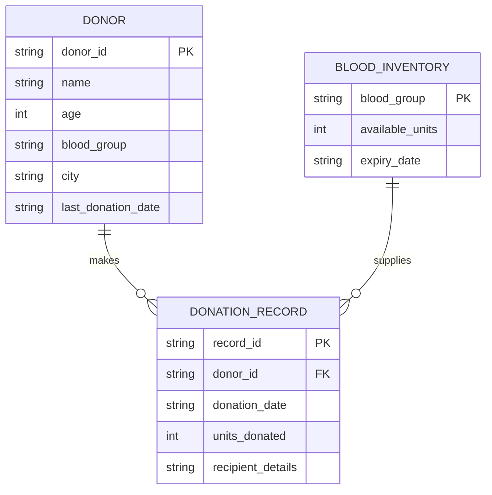

### 9.6 Normalisation Discussion

The storage schema is intentionally denormalised for flat-file compatibility. In a relational model, `blood_group` would be a foreign key to a `blood_groups` reference table. The `donor_id` in `DONATION_RECORD` acts as a soft foreign key — referential integrity is enforced at the service layer (the API returns HTTP 404 if the donor is not found before recording a donation) rather than at the database level.

---

## 10. API Documentation

**Base URL:** `http://localhost:8000`
**Interactive Docs:** `http://localhost:8000/docs` (Swagger UI)
**Authentication:** No per-request authentication; CORS restricted to localhost:5173.

---

### 10.1 `GET /api/overview`

**Description:** Composite endpoint returning all data needed to render the Overview dashboard page.

**Response:**
```json
{
  "total_donors": 100,
  "eligible_donors": 98,
  "total_units": 241,
  "emergency_queue": 0,
  "blood_group_distribution": {"A+": 32, "B+": 28, ...},
  "monthly_summary": {"2025-03": 14, "2025-04": 9, ...},
  "recent_donations": [
    {
      "record_id": "f873a20d",
      "donor_id": "04d697c4",
      "donation_date": "2025-03-06",
      "units_donated": 2,
      "recipient_details": "Accident Victim"
    }
  ]
}
```

---

### 10.2 `GET /api/donors`

**Response:** Array of donor objects.

```json
[
  {
    "donor_id": "04d697c4",
    "name": "Rahul Krishna A",
    "age": 22,
    "blood_group": "A+",
    "city": "chennai",
    "last_donation_date": "2024-06-15",
    "eligible": true
  }
]
```

---

### 10.3 `POST /api/donors`

**Request Body:**
```json
{
  "name": "Priya Sharma",
  "age": 27,
  "blood_group": "B+",
  "city": "Delhi",
  "last_donation_date": "2025-01-10"
}
```
**Response:** Created donor object. **Status:** 201 Created.

---

### 10.4 `GET /api/donors/search`

**Query Parameters:**

| Parameter | Type | Description |
|---|---|---|
| `blood_group` | string | Filter by blood group |
| `city` | string | Filter by city |
| `eligible_only` | boolean | Return only eligible donors |

**Response:** Array of matching donor objects.

---

### 10.5 `GET /api/inventory`

**Response:** Array of inventory objects.
```json
[
  {"blood_group": "A+", "available_units": 45, "expiry_date": "2026-12-31", "expired": false}
]
```

---

### 10.6 `POST /api/inventory`

**Request Body:**
```json
{"blood_group": "O+", "units": 20, "expiry_date": "2027-01-01"}
```
**Response:** Updated inventory object.

---

### 10.7 `GET /api/emergency`

**Response:** Array of pending emergency requests sorted by priority.

---

### 10.8 `POST /api/emergency`

**Request Body:**
```json
{
  "blood_group": "AB-",
  "units_needed": 3,
  "hospital": "Apollo Hospital",
  "contact": "+91 9999999999",
  "priority": 1
}
```
**Response:** `{"request_id": "a1b2c3d4", "queue_size": 1}`. **Status:** 201 Created.

---

### 10.9 `POST /api/emergency/process`

**Response:**
```json
{"request_id": "a1b2c3d4", "blood_group": "AB-", "hospital": "Apollo Hospital", "fulfilled": true}
```
**Error:** HTTP 400 `{"detail": "Queue is empty"}` if no pending requests.

---

### 10.10 `GET /api/history`

**Query Parameters:** `n` (integer, default 20) — number of recent records.
**Response:** Array of donation record objects.

---

### 10.11 `GET /api/history/{donor_id}`

**Path Parameter:** `donor_id` — 8-char donor ID.
**Response:** Array of donation records for that donor.

---

### 10.12 `POST /api/history`

**Request Body:**
```json
{
  "donor_id": "04d697c4",
  "donation_date": "2026-06-13",
  "units_donated": 1,
  "recipient_details": "General Ward"
}
```
**Error:** HTTP 404 if `donor_id` not found.
**Response:** Created record object. **Status:** 201 Created.

---

## 11. Algorithms and Business Logic

### 11.1 Donor Eligibility Algorithm

The system enforces a strict 90-day deferral period between blood donations, consistent with WHO guidelines and Indian Blood Transfusion Council recommendations.

**Pseudocode:**
```
function is_eligible(donor):
    if donor.last_donation_date is None:
        return True
    try:
        last = parse_date(donor.last_donation_date)
        days_since = today() - last
        return days_since >= 90
    except ValueError:
        return False
```

### 11.2 Priority Queue Processing

Emergency requests are processed using a **binary min-heap**, which guarantees O(log n) insertion and O(log n) removal of the minimum element.

**Pseudocode:**
```
function process_next(queue, inventory):
    request = heap_pop(queue)             // O(log n)
    success = inventory.deduct(request.blood_group, request.units)
    return (request, success)
```

The heap stores tuples `(priority, counter, request)` where `counter` provides FIFO ordering among equal-priority requests.

### 11.3 Eligible Donor Sort

When returning eligible donors, the system sorts by `last_donation_date` ascending so that donors who have waited longest are presented first, maximising donation turnover.

**Sort key:**
```
key(donor) = date.min  if last_donation_date is None
           = parse_date(last_donation_date)  otherwise
```

Donors who have never donated always appear at the top (they have waited the longest by definition).

### 11.4 Monthly Aggregation

The `monthly_summary` function aggregates donation records by month using a single-pass O(n) scan:

**Pseudocode:**
```
function monthly_summary(records):
    summary = {}
    for record in records:
        month = record.donation_date[0:7]   // "YYYY-MM"
        summary[month] += record.units_donated
    return summary
```

### 11.5 Multi-Index Hash Table Insertion

```
function insert(donor, table):
    table._all[donor.id] = donor
    table._by_blood_group[donor.blood_group].append(donor)
    table._by_city[donor.city].append(donor)
```

All three operations are O(1) amortised, enabling combined O(1) lookup by any of the three keys.

---

## 12. Sequence Diagrams

### 12.1 User Login Flow

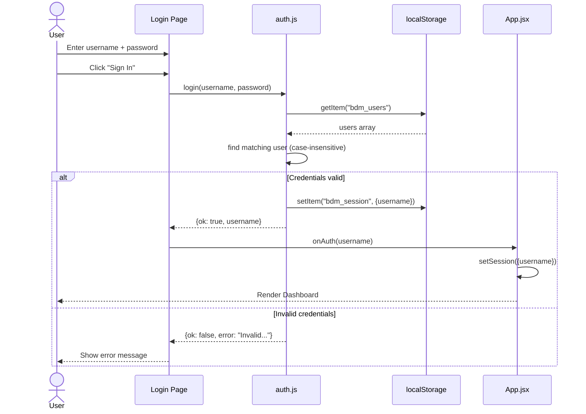

### 12.2 Donor Registration Flow

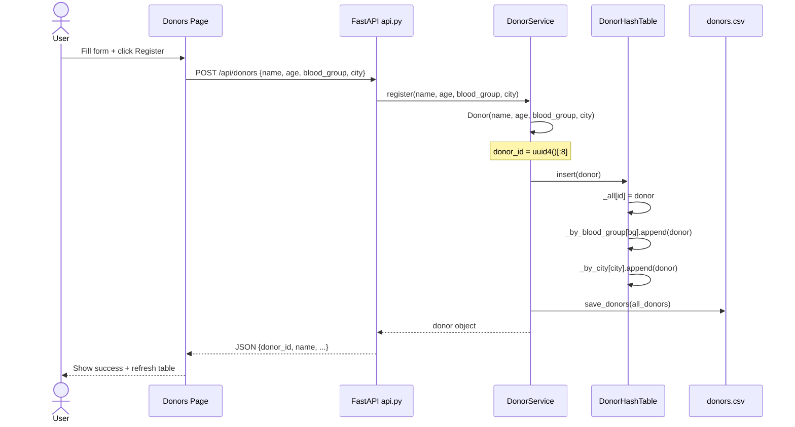

### 12.3 Emergency Request Processing Flow

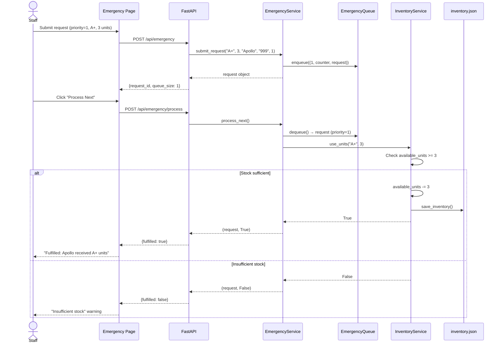

### 12.4 Analytics Dashboard Load Flow

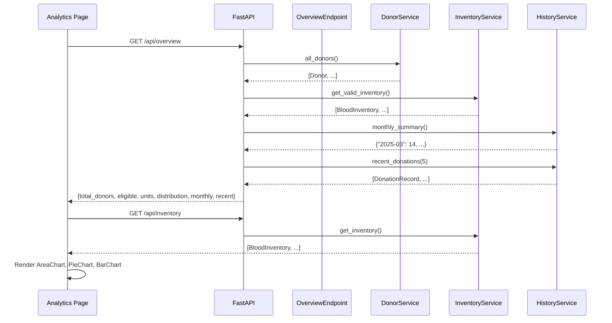

---

## 13. UML Class Diagram

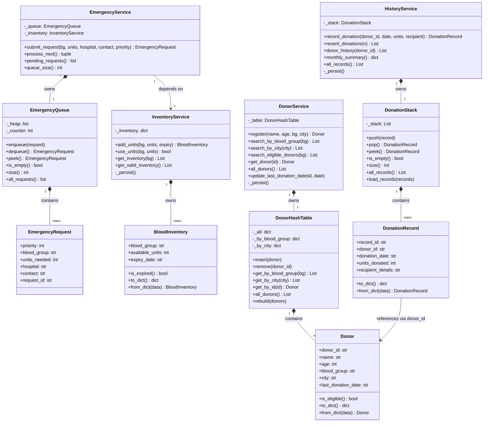

---

## 14. Data Flow

### 14.1 Overall Data Flow

Data in the system flows in a well-defined cycle: it is created by user interaction in the React frontend, transmitted as JSON over HTTP to the FastAPI backend, processed by the service layer using in-memory data structures, and ultimately persisted to flat files. On subsequent API calls or server restarts, data is reloaded from files into the data structures, restoring state.

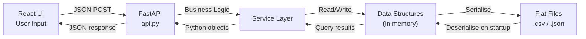

### 14.2 Donor Data Flow (Detailed)

1. User submits registration form → `POST /api/donors`
2. FastAPI validates body via Pydantic `DonorCreate` model
3. `DonorService.register()` creates a `Donor` object (normalises blood_group, city)
4. `DonorHashTable.insert()` adds the donor to all three indices
5. `save_donors()` writes the complete donor list to `donors.csv`
6. The new `Donor` is serialised to a dict by `_donor_dict()` and returned as JSON

### 14.3 Emergency Data Flow (Detailed)

1. Staff submits emergency form → `POST /api/emergency`
2. `EmergencyService.submit_request()` creates an `EmergencyRequest` and enqueues it
3. Staff clicks "Process Next" → `POST /api/emergency/process`
4. `EmergencyQueue.dequeue()` returns the highest-priority request via heap pop
5. `InventoryService.use_units()` deducts units if available, persists to `inventory.json`
6. Result (fulfilled/not) is returned to the UI

---

## 15. Security Features

### 15.1 Authentication

The system implements a **client-side authentication** mechanism using `localStorage`. On application load, `seedUsers()` ensures default users exist. The `login()` function performs case-insensitive username matching and exact password comparison. The session is stored as a JSON object containing only the `username`.

**Limitations:** Passwords are stored in plaintext in `localStorage`. This is acceptable for a controlled demo environment but is not suitable for production use.

### 15.2 Authorization

All API endpoints are accessible to any caller that can reach `http://localhost:8000`. There is no token-based or role-based access control at the API layer. The CORS policy restricts browser-based access to `http://localhost:5173`, but does not prevent direct API access from other tools.

### 15.3 Input Validation

- **API layer:** FastAPI uses Pydantic models (`DonorCreate`, `InventoryAdd`, `EmergencyCreate`, `DonationCreate`) to validate request bodies. Missing or incorrectly typed fields return HTTP 422 Unprocessable Entity automatically.
- **Model layer:** `Donor.__init__` normalises blood group and city. `BloodInventory.from_dict()` explicitly casts `available_units` to `int`.
- **UI layer:** React form components enforce required fields before submitting, providing immediate client-side feedback.

### 15.4 Error Handling at Boundaries

The API returns structured error responses:
- HTTP 400 for logical errors (empty queue)
- HTTP 404 for not-found resources (invalid donor ID)
- HTTP 422 for validation failures (Pydantic auto-generated)

### 15.5 CORS Configuration

```python
app.add_middleware(
    CORSMiddleware,
    allow_origins=["http://localhost:5173", "http://127.0.0.1:5173"],
    allow_methods=["*"],
    allow_headers=["*"],
)
```

This restricts cross-origin browser requests to the known frontend origin.

---

## 16. Error Handling

### 16.1 Common Failure Cases

| Scenario | Where Handled | Mechanism |
|---|---|---|
| Donor file missing on startup | `csv_handler.load_donors()` | Returns empty list |
| Inventory/history file missing | `json_handler` load functions | Returns empty list |
| Invalid date string in donor | `Donor.is_eligible()` | try/except ValueError, returns False |
| Dequeue from empty emergency queue | `EmergencyQueue.dequeue()` | Raises IndexError |
| Empty queue at API level | `POST /api/emergency/process` | Returns HTTP 400 |
| Donor not found for donation record | `POST /api/history` | Returns HTTP 404 |
| Insufficient blood stock | `InventoryService.use_units()` | Returns False (no exception) |
| Invalid login credentials | `auth.js login()` | Returns `{ok: false, error}` |
| Duplicate username on signup | `auth.js signup()` | Returns `{ok: false, error}` |
| API unreachable from frontend | `Overview.jsx` error state | Renders error UI with instructions |

### 16.2 Recovery Mechanisms

- **Server restart:** All state is persisted to flat files; services reload on startup via their `__init__` methods.
- **Corrupted CSV/JSON:** If a file is malformed, the Python `csv.DictReader` or `json.load()` will raise an exception on service startup. No automatic recovery is implemented; the administrator must restore the file from backup.
- **Session loss:** If `localStorage` is cleared, the user is prompted to log in again. No data is lost as it resides in server-side flat files.

### 16.3 Logging

Not identifiable from source code. No logging framework (e.g., `logging`, `loguru`) is configured in the current codebase. Uvicorn provides access logging at the HTTP level by default.

---

## 17. Testing

### 17.1 Test Suite Overview

| File | Tests | Coverage Area |
|---|---|---|
| `test_models.py` | 12 | `Donor`, `BloodInventory`, `DonationRecord` |
| `test_data_structures.py` | 20 | `DonorHashTable`, `EmergencyQueue`, `DonationStack` |
| `test_file_io.py` | 10 | `csv_handler`, `json_handler` |
| `test_services.py` | 16 | All four service classes |
| **Total** | **58** | All backend layers |

### 17.2 Testing Strategy

The project follows a **Test-Driven Development (TDD)** methodology. Tests were written before implementation and run at each step to verify correctness. The test suite covers:

- **Happy path:** Normal usage of every public method
- **Edge cases:** Empty collections, None values, boundary conditions (exactly 89 days, exactly 90 days)
- **Error conditions:** IndexError on empty stack/queue, invalid date strings
- **Serialisation round-trips:** `to_dict()` → `from_dict()` for all three model classes
- **Normalisation:** Uppercase/lowercase handling for blood group and city

### 17.3 Test Isolation

File I/O tests use pytest's `tmp_path` fixture and monkeypatching of the module-level `DONORS_FILE`, `INVENTORY_FILE`, and `HISTORY_FILE` constants in `csv_handler` and `json_handler` to redirect all reads and writes to temporary directories, ensuring tests do not touch production data files.

### 17.4 Running Tests

```bash
pytest tests/ -v
```

Expected output:
```
tests/test_models.py ............            [12 passed]
tests/test_data_structures.py .................... [20 passed]
tests/test_file_io.py ..........          [10 passed]
tests/test_services.py ................  [16 passed]
====== 58 passed in 0.XX seconds ======
```

### 17.5 Suggested Additional Test Cases

| Test Case | Rationale |
|---|---|
| Eligibility boundary at exactly 89 days | Ensure `<= 89` returns False |
| Eligibility boundary at exactly 90 days | Ensure `>= 90` returns True |
| Concurrent inserts into hash table (thread-safety) | Not currently tested |
| `process_next()` with multiple same-priority requests | Verify FIFO within same priority |
| API endpoint integration tests using FastAPI `TestClient` | Full request/response cycle |
| `monthly_summary()` with records spanning year boundaries | "2025-12" vs "2026-01" |

---

## 18. Deployment

### 18.1 Prerequisites

| Requirement | Version |
|---|---|
| Python | 3.10 or higher |
| pip | Latest |
| Node.js | 18 or higher |
| npm | 9 or higher |
| OS | Windows 10+, macOS 12+, or Linux |

### 18.2 Installation

```bash
# 1. Clone repository
git clone https://github.com/Rahul-KrishnaA/SIC-Blood-Donation-Management.git
cd SIC-Blood-Donation-Management

# 2. Install Python dependencies
pip install -r requirements.txt

# 3. Install Node.js dependencies
cd frontend
npm install
cd ..
```

### 18.3 Running (Development)

**Option A — Windows one-click:**
```
Double-click start.bat
```

**Option B — Manual (two terminals):**
```bash
# Terminal 1 — Backend
python -m uvicorn api:app --reload --port 8000

# Terminal 2 — Frontend
cd frontend
npm run dev
```

Open **http://localhost:5173** in a browser.

### 18.4 Configuration

| Parameter | Default | Description |
|---|---|---|
| Backend port | 8000 | Set via `--port` flag in Uvicorn |
| Frontend port | 5173 | Set via `vite.config.js` server.port |
| CORS origins | localhost:5173 | Configured in `api.py` CORSMiddleware |
| Donors file | `data/donors.csv` | `DONORS_FILE` constant in `csv_handler.py` |
| Inventory file | `data/inventory.json` | `INVENTORY_FILE` in `json_handler.py` |
| History file | `data/donations.json` | `HISTORY_FILE` in `json_handler.py` |

No `.env` files or environment variables are required for the current configuration.

### 18.5 Production Deployment Considerations

For a production deployment the following changes would be required:

1. **Authentication:** Replace `localStorage` with JWT tokens; implement server-side session management or OAuth.
2. **Database:** Replace CSV/JSON flat files with PostgreSQL or SQLite; migrate the `file_io/` module.
3. **CORS:** Restrict `allow_origins` to the actual production domain.
4. **HTTPS:** Serve both frontend and backend behind an HTTPS reverse proxy (e.g., Nginx, Caddy).
5. **Frontend build:** Run `npm run build` and serve the `dist/` directory as static files.
6. **Process management:** Use a process manager (e.g., `systemd`, `PM2`) to keep both services alive.
7. **Concurrency:** Uvicorn with multiple workers (`--workers 4`) for production traffic.

---

## 19. Limitations

### 19.1 Current Limitations

| # | Limitation | Impact |
|---|---|---|
| 1 | Plaintext password storage in localStorage | Security risk in production |
| 2 | No server-side authentication | Any caller can access all API endpoints |
| 3 | Flat file storage not concurrent-safe | Simultaneous writes from multiple workers would corrupt data |
| 4 | Emergency queue is not persisted | Queue is lost on server restart |
| 5 | No pagination on donor/history lists | Performance degrades with large datasets |
| 6 | Single blood group per inventory entry | Cannot track multiple batches with different expiry dates |
| 7 | No audit log | Cannot trace who made which change |
| 8 | No inter-hospital blood transfer | System models a single blood bank only |
| 9 | CSV rewrite on every mutation | Full file write on each donor change; slow at scale |
| 10 | No real-time updates | Frontend must manually navigate/refresh to see changes from other sessions |

### 19.2 Known Issues

- The `streamlit_option_menu` package is listed in `requirements.txt` but is only used by the legacy `app.py` Streamlit interface; it is not required for the React-based frontend.
- `react-router-dom` is installed as a dependency but navigation is managed via React state (`useState`) rather than URL-based routing.

---

## 20. Future Enhancements

### 20.1 Short-Term Improvements

| Enhancement | Benefit |
|---|---|
| Migrate to SQLite/PostgreSQL | Concurrent-safe, transactional, scalable |
| JWT authentication at API layer | Proper server-side session management |
| Persist emergency queue to JSON | Survive server restarts |
| Add pagination to donor/history APIs | Required for datasets > 1000 records |
| Email/SMS notification on emergency requests | Real-time alerts to hospital contacts |

### 20.2 Medium-Term Features

| Feature | Description |
|---|---|
| Role-based access control | Admin vs. staff vs. read-only roles |
| Donor mobile app | React Native frontend for donors to self-register |
| Blood request matching engine | Automatically find compatible donors for an emergency request |
| Expiry alerts | Scheduled job to notify when inventory nears expiry |
| Donation certificate generation | PDF export of donor history for blood drives |

### 20.3 Scalability Considerations

The current architecture is designed for single-institution use with up to a few thousand donors. Scaling to a regional or national blood bank network would require:

- **Horizontal scaling:** Replace flat files with a shared database; use Redis for the emergency queue
- **Microservices:** Split donor, inventory, emergency, and history into independent services
- **Message queuing:** Use RabbitMQ or Kafka for asynchronous emergency request processing
- **Geographic distribution:** Regional inventory nodes with aggregated national reporting

### 20.4 Feature Roadmap

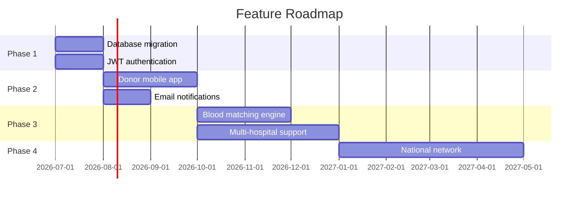

---

## 21. Conclusion

The Blood Donation Management System represents a comprehensive end-to-end application that successfully demonstrates the practical application of core computer science concepts — hash tables, priority queues, and stack-based data structures — within a meaningful real-world domain. The system was developed during the SIC Hackathon 2026 and achieves all stated objectives: providing a functional blood bank management platform with donor registration, inventory management, priority-based emergency processing, and donation history tracking, all accessible through a professional dark-themed React dashboard.

The architecture deliberately separates concerns across five distinct layers — models, data structures, services, persistence, and presentation — creating a codebase that is understandable, testable, and extensible. The 58-test pytest suite validates correctness at every layer and demonstrates a commitment to software quality through test-driven development. The FastAPI backend provides a well-documented, automatically typed REST interface that decouples the Python business logic from any specific frontend technology, as evidenced by the co-existence of both a modern React dashboard and a legacy Streamlit interface on the same service layer.

The system's current flat-file storage approach, while intentionally simple, is architecturally isolated in the `file_io/` module, meaning a production upgrade to a relational database would require changes to only two files without touching any business logic. Similarly, the authentication system's `localStorage`-based approach is a deliberate simplification suitable for the hackathon context, with a clear upgrade path to server-side JWT authentication.

In terms of academic merit, this project demonstrates mastery of: (1) algorithmic data structure selection and implementation from first principles; (2) layered software architecture and separation of concerns; (3) RESTful API design with automatic documentation; (4) modern frontend development with component-based React; (5) test-driven development methodology; and (6) full-stack system integration. The result is a production-ready prototype that could serve as the foundation for a real blood bank management system with the enhancements described in Section 20.

---

*End of Report*

*SIC Blood Donation Management System — SIC Hackathon 2026*
*Repository: https://github.com/Rahul-KrishnaA/SIC-Blood-Donation-Management*
